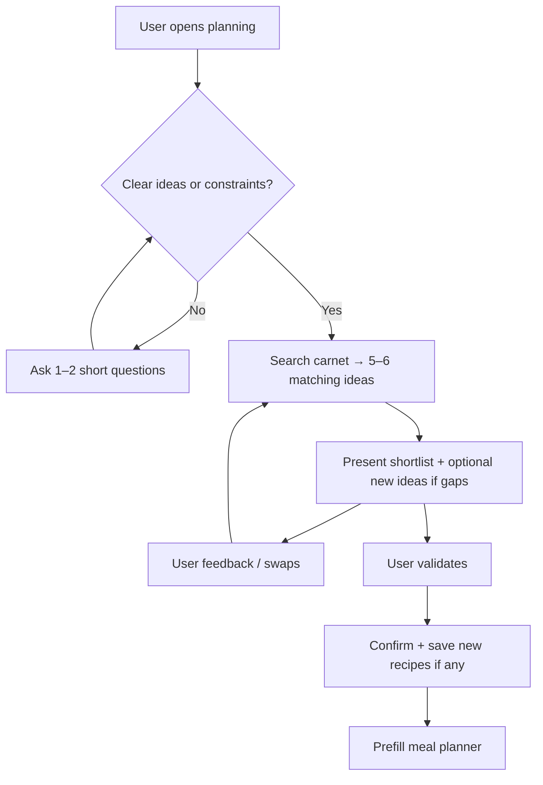
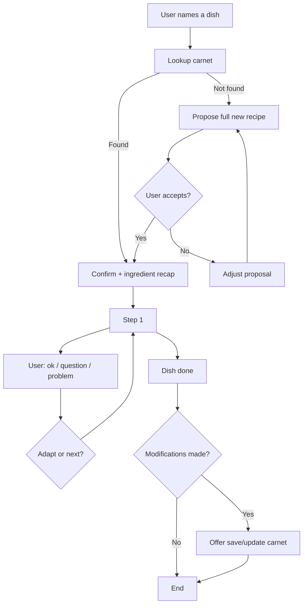

# PRD — Chez Verdi Assistant

**Product:** Cook Assistant (Chez Verdi)  
**Document:** Assistant IA — Product Requirements  
**Status:** Draft v1  
**Last updated:** June 2025  

**Related docs:** [ROADMAP.md](./ROADMAP.md) · [SUPABASE_INTEGRATION.md](./SUPABASE_INTEGRATION.md) · [README.md](../README.md)

---

## 1. Summary

Chez Verdi is a personal meal-planning PWA for a household (initially a couple). The **Assistant** is the conversational layer that connects the recipe carnet, meal planner, and — later — grocery list.

The assistant operates in **two modes**:

1. **Week planning** — understand what the user wants, surface **5–6 matching ideas from the carnet**, iterate, then validate into the meal planner (new recipes only when needed).
2. **Live cooking** — guide the user step by step through a named dish, with real-time adaptations and optional recipe save/update at the end.

This PRD defines product behaviour, UX, phased architecture (prompt → tools/skills), and delivery milestones. It is the source of truth for assistant work after the initial prompt prototype.

---

## 2. Problem & opportunity

### Problem

Planning meals and cooking from saved recipes involves friction:

- Browsing the carnet does not help compose a **balanced week**.
- New ideas live outside the app; adding them means **manual entry**.
- While cooking, the user needs **hands-free, step-by-step** guidance — not a static recipe page.
- Changes made while cooking (substitutions, timing) are **lost** unless manually edited later.

### Opportunity

A single chat assistant that:

- Reads the real carnet (Supabase).
- Proposes actionable weekly menus.
- Writes back to the carnet and meal planner when the user confirms.
- Guides cooking in the moment and captures improvements.

### Product goal

> **Reduce weekly meal-planning time and make cooking from the carnet feel guided and personal — without requiring accounts or complex setup.**

---

## 3. Users & context

| Attribute | Detail |
|-----------|--------|
| **Primary users** | Couple cooking at home |
| **Auth** | None (personal PWA, private Supabase project) |
| **Devices** | Mobile-first; desktop supported |
| **Language** | French (UI + assistant) |
| **Carnet size (MVP)** | ~10–50 recipes |
| **AI provider** | OpenAI (`gpt-4o-mini`); Gemini later |

### Primary personas

**Planner** — “What are we eating this week?”  
Wants inspiration grounded in their carnet first; refines through short back-and-forth, then one tap to fill the planner.

**Cook** — “I'm making the risotto now.”  
Wants one step at a time, help when something goes wrong, optional save of tweaks.

---

## 4. Scope

### In scope (this PRD)

- Two assistant modes (planning + cooking).
- Carnet read/write via Supabase.
- Meal planner prefill on validated week plan.
- Structured UI for new recipes, validation, cooking progress, post-cook updates.
- Phased move from monolithic prompt to router + skills + tools.

### Out of scope (later)

- URL / social import (Instagram, TikTok).
- Smart grocery list generation from chat.
- Multi-user / accounts.
- Voice input.
- Gemini provider (noted as future).

---

## 5. Current state (baseline)

### Shipped

| Area | Status |
|------|--------|
| Chat UI (full page, mobile + desktop) | ✅ |
| OpenAI integration | ✅ |
| Carnet loaded into system prompt each turn | ✅ |
| Monolithic system prompt (2 modes) | ✅ |
| Parser for structured lines | ✅ |
| Recipe cards for carnet matches (`RECETTES:`) | ✅ |
| Manual “Au planning” per card | ✅ |
| Step-by-step cooking (text only) | ✅ |
| New recipe suggestion cards + save | ✅ |
| Week plan validation → prefill planner | ✅ |
| Cooking step progress UI | ✅ |
| Post-cook recipe create/update | ✅ |

### Not wired

| Area | Status |
|------|--------|
| Real tool calls (DB lookup, writes) | ⏳ |
| Intent router / skill prompts | ⏳ |
| Cooking quick-reply chips (M3) | ⏳ |

**Code references:** `src/lib/openai.ts`, `src/lib/chatRecipes.ts`, `src/pages/ChatPage.tsx`, `src/lib/recipes.ts`, `src/lib/planning.ts`

---

## 6. Mode 1 — Week planning

### 6.1 Intent

User wants to decide **what to eat across the week** before shopping or cooking.

**Trigger phrases (examples):**

- “Planifie la semaine”
- “Qu'est-ce qu'on mange cette semaine ?”
- “On a du saumon à finir”
- Chip: *Planifier la semaine*

### 6.2 User flow



### 6.3 Behaviour requirements

| ID | Requirement |
|----|-------------|
| P1 | **If the user has not given clear ideas or constraints** (envies, régime, ingrédients, nombre de repas, soirs chargés…), **ask 1–2 short questions** before proposing anything. Do not dump a full week menu on a vague opener. |
| P2 | **Once intent is clear**, use the user's criteria to **search the carnet and surface 5–6 matching recipe ideas** (not the whole library). Present them as a focused shortlist to discuss and iterate. |
| P3 | **Iterate** on the shortlist: swap a dish, narrow/widen criteria, add or remove an idea. Re-search the carnet when constraints change. |
| P4 | **New recipes** only when the carnet has gaps for what the user wants — not as a default bulk mix. Propose sparingly (1–2 at a time if needed), not dozens of outside ideas. |
| P5 | When carnet is empty, ask questions first, then propose a small set of new recipes (same 5–6 scale). |
| P6 | Do not repeat the same recipe in one week unless user asks. |
| P7 | On explicit validation (“c'est bon”, “valide”, “on part là-dessus”), produce a structured week plan. |
| P8 | New recipes in the final plan must be saveable to Supabase before or during planner prefill. |
| P9 | Carnet recipe details must not be duplicated in chat prose (cards handle display). |

### 6.4 UX requirements

| ID | Requirement |
|----|-------------|
| P-UX1 | Show **carnet recipe cards** under assistant messages when carnet recipes are recommended. |
| P-UX2 | Show **new recipe cards** (title, time, portions, tags preview) with **Ajouter au carnet**. |
| P-UX3 | When a full week proposal is ready, show **Valider le menu** CTA that applies the plan. |
| P-UX4 | After validation, show confirmation + link to **Planning** (and optionally grocery). |
| P-UX5 | If a proposed title has no carnet match, treat as new recipe (not silent failure). |
| P-UX6 | Loading and error states for save/prefill actions. |

### 6.5 Structured output (interim → target)

**Interim (prompt lines, parsed today):**

```
RECETTES: Titre carnet 1 | Titre carnet 2
NOUVELLES_RECETTES_JSON: [{"title":"...","ingredients":[],"steps":[],"cookingTime":30,"servings":4,"tags":[]}]
PLAN_SEMAINE: lun-diner:Titre | mar-dejeuner:Autre
```

**`PLAN_SEMAINE` format:**

- Days: `lun`, `mar`, `mer`, `jeu`, `ven`, `sam`, `dim`
- Meals: `petit-dejeuner`, `dejeuner`, `diner`
- Example: `lun-diner:Poulet rôti | mer-dejeuner:Salade composée`

**Target (tool call):**

```ts
applyWeekPlan({
  slots: [{ day: 0, meal: 'dinner', recipeTitle: 'Poulet rôti' }, ...]
})
```

Resolver maps titles → recipe IDs (carnet or newly created).

---

## 7. Mode 2 — Live cooking

### 7.1 Intent

User is **about to cook or is cooking** a specific dish and wants guided help.

**Trigger phrases:**

- “Je vais faire le risotto”
- “Guide-moi pour la tarte”
- “On cuisine le poulet rôti”
- Chip: *Je vais cuisiner*

### 7.2 User flow



### 7.3 Behaviour requirements

| ID | Requirement |
|----|-------------|
| C1 | **Always lookup carnet first** by title (exact, then fuzzy). |
| C2 | If found: confirm recipe, brief ingredient recap, then **one step per message**. |
| C3 | If not found: propose complete recipe; wait for explicit OK before guiding. |
| C4 | Wait for user signal (“ok”, “c'est fait”, “suivant”) before next step. |
| C5 | Handle mid-cook issues: substitutions, missing ingredient, timing, portions, mistakes. |
| C6 | Track deviations from original fiche during session. |
| C7 | At end, if deviations exist, **ask** whether to save/update carnet (never auto-write). |
| C8 | On user confirmation, persist via `createRecipe` or `updateRecipe`. |

### 7.4 UX requirements

| ID | Requirement |
|----|-------------|
| C-UX1 | **Cooking session header**: active recipe title + step progress (e.g. “Étape 2/7”). |
| C-UX2 | Optional compact ingredient recap at session start (collapsible on mobile). |
| C-UX3 | Quick-reply chips: *C'est fait*, *J'ai un problème*, *Pause*. |
| C-UX4 | End-of-session card: **Enregistrer les modifications** / **Non merci**. |
| C-UX5 | Distinguish visually: carnet recipe vs new recipe not yet saved. |
| C-UX6 | Do not show carnet recipe cards during step-by-step (avoid clutter). |

### 7.5 Structured output (interim → target)

**Interim:**

```
RECETTE_ACTIVE: <uuid>|Titre exact
RECETTE_ACTIVE: new|Titre exact
ETAPE_CUISSON: 2/7
NOUVELLES_RECETTES_JSON: [...]   // option B, before session
MAJ_RECETTE_JSON: {"id":"...","title":"...","ingredients":[],"steps":[],"cookingTime":30,"servings":4,"tags":[]}
```

**Target (tools):**

```ts
findRecipe({ query: 'risotto' }) → Recipe | null
createRecipe({ ... }) → Recipe
updateRecipe({ id, ... }) → Recipe
```

---

## 8. Architecture

### 8.1 Principles

1. **Tools own truth** — DB reads/writes happen in code, not in prompt fiction.
2. **Skills own focus** — Small prompts per mode; avoid one 3k-token system prompt at scale.
3. **User confirms side effects** — No silent writes to carnet or planner.
4. **Graceful degradation** — If OpenAI is down or unconfigured, chat explains clearly (already partially implemented).

### 8.2 Phased architecture

#### Phase A — Prompt + parser (current)

- Single system prompt, full carnet in context.
- Structured trailing lines parsed client-side.
- **Limitation:** brittle formats, context bloat, fuzzy “DB lookup” in LLM.

#### Phase B — Wiring (next ship)

- Keep Phase A prompt.
- ChatPage reacts to parsed payloads: save recipes, apply plan, update recipe, step UI.
- Add `applyWeekPlan(slots)` in `planning.ts`.

#### Phase C — Router + skills + tools (target)

```
┌─────────────┐
│  ChatPage   │
└──────┬──────┘
       │ messages
       ▼
┌─────────────┐     ┌──────────────────┐
│   Router    │────►│ planning skill   │
│ (intent)    │     │ cooking skill    │
└─────────────┘     └────────┬─────────┘
                             │ tool calls
                             ▼
                    ┌──────────────────┐
                    │ assistantTools   │
                    │ · listRecipes    │
                    │ · findRecipe     │
                    │ · createRecipe   │
                    │ · updateRecipe   │
                    │ · applyWeekPlan  │
                    └────────┬─────────┘
                             ▼
                    ┌──────────────────┐
                    │ Supabase +       │
                    │ localStorage     │
                    │ (meal plan)      │
                    └──────────────────┘
```

**Router inputs:** last user message, optional session state (`mode`, `activeRecipeId`, `cookingStep`).

**Router outputs:** `planning` | `cooking` | `general` (fallback chit-chat → nudge toward modes).

**Implementation options (in order of preference):**

1. Lightweight rules + keywords for MVP router (zero extra API cost).
2. Optional `gpt-4o-mini` classifier call if rules are insufficient.

### 8.3 Tool specifications

| Tool | Description | Args | Returns |
|------|-------------|------|---------|
| `listRecipes` | Carnet summary for planning | `{ tags?: string[] }` | `RecipeSummary[]` |
| `findRecipe` | Lookup by title | `{ query: string }` | `Recipe \| null` |
| `getRecipe` | Full fiche by id | `{ id: string }` | `Recipe` |
| `createRecipe` | New carnet entry | `RecipeInput` | `Recipe` |
| `updateRecipe` | Update existing | `{ id, ...partial }` | `Recipe` |
| `applyWeekPlan` | Write meal slots | `{ slots: PlanSlot[] }` | `{ applied: number, skipped: Slot[] }` |

`PlanSlot`: `{ day: 0–6, meal: 'breakfast'|'lunch'|'dinner', recipeId: string }`

**`applyWeekPlan` rules:**

- Map day names from assistant (`lun` → `0`, Monday-based week).
- Overwrite existing slots only for slots in payload (document behaviour).
- Skip slots whose `recipeId` is invalid; return skipped list for UI warning.

### 8.4 Context strategy (Phase C)

| Mode | Context sent to LLM |
|------|---------------------|
| Planning | `listRecipes` summary only (~title, tags, time); full fiche on demand via tool |
| Cooking | `findRecipe` / `getRecipe` for **one** active recipe only |
| General | Minimal carnet count + chips |

**Target:** carnet 100+ recipes without sending all steps every turn.

### 8.5 Session state (client)

```ts
interface AssistantSession {
  mode: 'planning' | 'cooking' | null;
  cooking?: {
    recipeId: string | null;  // null = new, not yet saved
    title: string;
    step: number;
    totalSteps: number;
    pendingChanges: boolean;
  };
  pendingWeekPlan?: WeekPlanEntry[];
  pendingNewRecipes?: SuggestedRecipe[];
}
```

Persist in React state for MVP; optional `sessionStorage` for refresh survival (v2).

---

## 9. Functional requirements (cross-cutting)

| ID | Requirement | Priority |
|----|-------------|----------|
| F1 | Assistant language: French | P0 |
| F2 | No markdown in assistant prose | P0 |
| F3 | Max **5–6 carnet ideas** per planning shortlist (`RECETTES:` line) | P1 |
| F4 | OpenAI API key via `VITE_OPENAI_API_KEY` | P0 |
| F5 | Recipes from Supabase on each session load; refresh after writes | P0 |
| F6 | Meal plan in localStorage (unchanged until Supabase planning migration) | P0 |
| F7 | Clear error if API key missing | P0 |
| F8 | “Nouvelle conversation” clears messages + session state | P1 |
| F9 | Initial message from Home search bar preserved | P1 |

---

## 10. Non-functional requirements

| ID | Requirement |
|----|-------------|
| NF1 | P95 assistant response < 8s on mobile network (depends on OpenAI) |
| NF2 | No recipe or API keys in client logs |
| NF3 | Tool/write failures show user-facing French error; no partial silent failure |
| NF4 | `gpt-4o-mini` default; model configurable later |
| NF5 | `max_tokens` ≥ 1200 for planning proposals |

---

## 11. UI components (to build)

| Component | Mode | Description |
|-----------|------|-------------|
| `RecipeSuggestion` | Planning | Existing — carnet cards |
| `NewRecipeSuggestion` | Planning / Cooking | New recipe preview + *Ajouter au carnet* |
| `WeekPlanValidation` | Planning | Summary grid + *Valider le menu* |
| `CookingSessionBar` | Cooking | Title + `ETAPE_CUISSON` progress |
| `CookingQuickReplies` | Cooking | *C'est fait*, *Problème*, etc. |
| `RecipeUpdatePrompt` | Cooking | Post-cook save/update card |

---

## 12. Delivery milestones

### M1 — Wiring (Phase B) · **Shipped**

**Goal:** End-to-end value without architecture rewrite.

- [x] `NewRecipeSuggestion` + `createRecipe`
- [x] `WeekPlanValidation` + `applyWeekPlan` (title → id resolution, create missing recipes)
- [x] `CookingSessionBar` from `ETAPE_CUISSON`
- [x] `RecipeUpdatePrompt` + `createRecipe` / `updateRecipe`
- [x] Session state in `ChatPage`
- [x] Unit tests: `parseAssistantMessage`, `applyWeekPlan` mapping

**Exit criteria:** User can validate a week into planner and save a new recipe from chat without manual library entry.

### M2 — Router + skills (Phase C)

**Goal:** Reliable mode separation and smaller prompts.

- [ ] `src/lib/assistant/router.ts`
- [ ] `src/lib/assistant/skills/planning.ts` + `cooking.ts`
- [ ] OpenAI function calling loop in `src/lib/assistant/run.ts`
- [ ] `src/lib/assistant/tools.ts`
- [ ] Deprecate structured trailing lines (keep parser as fallback one release)

**Exit criteria:** Cooking never receives full-week instructions; planning never receives step 4 of 7.

### M3 — Polish & mobile cook test

- [ ] Quick-reply chips in cooking mode
- [ ] Real-device test: planning validation + 20-minute cook session
- [ ] Edge cases: ambiguous recipe title, empty carnet, full planner

### M4 — Future (out of PRD v1 scope)

- URL import skill
- Grocery skill (`buildGroceryList` tool)
- Gemini provider adapter
- Meal plan on Supabase

---

## 13. Success metrics

| Metric | Target (M1) |
|--------|-------------|
| Week plan validated → planner filled | Works in 95% of happy-path tests |
| New recipe saved from chat | < 3 taps after proposal |
| Cooking session completion | User reaches last step without abandoning (qualitative) |
| Wrong recipe matched | < 5% with carnet < 30 recipes (improve with `findRecipe` tool) |

---

## 14. Risks & mitigations

| Risk | Impact | Mitigation |
|------|--------|------------|
| Structured line parse failures | Broken UI actions | Phase C tools; validate JSON before UI; fallback message |
| Context too large | Cost, latency, lost instructions | Phase C context strategy |
| Mode bleed | Confusing UX | Router + focused skill prompts |
| Title collision (“Poulet” × 3) | Wrong recipe | `findRecipe` returns multiple → assistant asks disambiguation |
| User validates plan before new recipes saved | Orphan titles in planner | Validation flow: save new recipes first, then `applyWeekPlan` |
| OpenAI rate limits / errors | Blocked chat | Retry once; clear error; keep message history |

---

## 15. Open questions

| # | Question | Default if unresolved |
|---|----------|------------------------|
| Q1 | Overwrite existing planner slots on validate? | Only slots in `PLAN_SEMAINE`; leave others |
| Q2 | Auto-create new recipes on week validate without per-recipe confirm? | Batch confirm: “Ajouter 2 nouvelles recettes et remplir le planning ?” |
| Q3 | Breakfast in scope for planning? | Yes (schema supports); assistant can focus on dinner if user says so |
| Q4 | Persist cooking session across page navigation? | No for M1; sessionStorage in M2 |
| Q5 | When to migrate meal plan to Supabase? | Separate PRD; localStorage for M1–M2 |

---

## 16. Appendix

### A. File map (target)

```
src/lib/
  openai.ts              → thin wrapper / deprecated after M2
  chatRecipes.ts         → parser (fallback)
  recipes.ts             → Supabase CRUD (existing)
  planning.ts            → + applyWeekPlan
  assistant/
    router.ts
    run.ts               → tool loop
    tools.ts
    skills/
      planning.ts
      cooking.ts
    types.ts
```

### B. Example conversations (acceptance)

**Planning**

```
User: Planifie la semaine
Assistant: [1–2 questions — e.g. combien de soirs, envies, contraintes ?]
User: 4 dîners, 2 veggie, on veut du rapide
Assistant: [5–6 idées du carnet en prose courte] + carnet cards + éventuelle nouvelle idée si trou
User: Remplace le jeudi par autre chose de veggie
Assistant: [nouveau shortlist ajusté]
User: C'est bon
Assistant: [confirmation] + Valider le menu UI
→ Planner prefilled for selected slots
```

**Cooking**

```
User: Je vais faire le risotto aux champignons
Assistant: [found in carnet] On part sur le risotto ? Voici les ingrédients… Étape 1 : …
User: C'est fait
Assistant: Étape 2 : … [2/7 in session bar]
User: J'ai pas de vin blanc
Assistant: [substitution] … continue step
User: C'est fini
Assistant: Vous avez utilisé du cidre à la place du vin — j'enregistre ?
User: Oui
→ updateRecipe in Supabase
```

### C. ROADMAP sync

When M1 ships, update [ROADMAP.md](./ROADMAP.md) checkboxes under **Assistant IA**. When M2 ships, mark architecture item and reduce emphasis on structured lines.

---

*End of PRD v1*
