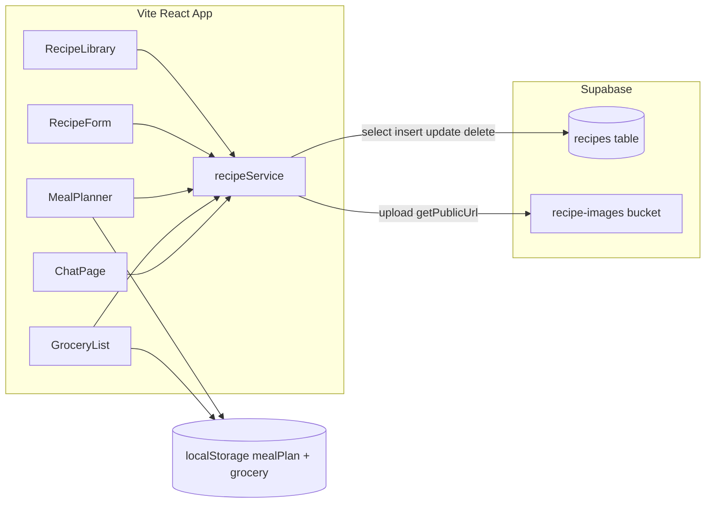

# Supabase Recipes Integration Plan

Step-by-step plan to replace localStorage recipe persistence with Supabase Postgres (ingredients + steps as `text[]`) and Supabase Storage for image uploads. Meal plan and grocery list stay on localStorage in this phase.

**Auth model:** no login — personal PWA, permissive anon policies on a private Supabase project.

---

## Progress checklist

Tick off as you go (works across multiple sessions):

- [x] **A1** — Supabase project created, `.env` with `VITE_SUPABASE_URL` + `VITE_SUPABASE_ANON_KEY`
- [x] **A2** — `recipes` table + RLS policies
- [x] **A3** — `recipe-images` Storage bucket + policies
- [x] **A4** — Smoke test (optional)
- [x] **B1** — `src/lib/recipes.ts` (CRUD, image upload, localStorage migration)
- [x] **B2** — `RecipeLibrary` + `RecipeForm` wired to Supabase
- [x] **B3** — Image file upload in form
- [x] **B4** — `MealPlanner`, `GroceryList`, `ChatPage` read from Supabase
- [x] **B5** — `npm run build` + manual test checklist
- [ ] **C** *(future)* — Smart grocery ingredient merging

---

## Current state

- Recipes are defined in [`src/types/recipe.ts`](../src/types/recipe.ts) as a flat object: `ingredients: string[]`, `steps: string[]`, optional `image` URL.
- All persistence goes through [`src/lib/supabase.ts`](../src/lib/supabase.ts) → `localStorageHelper` (despite the filename).
- Recipe CRUD lives in [`src/pages/RecipeLibrary.tsx`](../src/pages/RecipeLibrary.tsx); 4 files read recipes: `RecipeLibrary`, `MealPlanner`, `GroceryList`, `ChatPage`.
- Images today: optional URL text field in [`src/components/RecipeForm.tsx`](../src/components/RecipeForm.tsx) — no file upload.

---

## Target architecture



**DB row shape** (snake_case in Postgres, mapped to camelCase `Recipe` in app):

| App field | DB column | Type |
|-----------|-----------|------|
| `id` | `id` | `uuid` (auto-generated) |
| `title` | `title` | `text` |
| `image` | `image_url` | `text` (Storage public URL or external URL) |
| `ingredients` | `ingredients` | `text[]` |
| `steps` | `steps` | `text[]` |
| `cookingTime` | `cooking_time` | `int` |
| `servings` | `servings` | `int` |
| `tags` | `tags` | `text[]` |
| `createdAt` | `created_at` | `timestamptz` |

Using `text[]` for ingredients and steps matches the existing app model exactly — no normalized child tables needed.

---

## FAQ — Ingredients storage and grocery list

### Is it JSON?

**No.** The columns are Postgres **`text[]`** (native string arrays), not `json` or `jsonb`.

Supabase Table Editor often *displays* arrays in a JSON-like bracket format, e.g.:

```json
["400 g de pâtes", "2 tomates", "sel"]
```

That is just how the UI renders a `text[]` column. In the app, Supabase returns a normal JavaScript `string[]` — the same type as today's `Recipe.ingredients`.

### How does the grocery list get ingredients?

**No LLM call. No conversion step.** The grocery list already works on plain strings.

Today in [`src/pages/GroceryList.tsx`](../src/pages/GroceryList.tsx):

1. Load recipes for meals in the current plan
2. Loop `recipe.ingredients.forEach(...)` — each item is already a string like `"400 g de pâtes"`
3. Deduplicate by `ingredient.toLowerCase().trim()`
4. Display the string as the line item name

After Supabase, the only change is the **source** of recipes (`fetchRecipes()` instead of `localStorageHelper.getRecipes()`). The `Recipe` shape stays identical:

```ts
ingredients: string[]  // e.g. ["400 g de pâtes", "2 tomates"]
steps: string[]        // e.g. ["Faire bouillir l'eau", "Cuire 8 min"]
```

The mapper in `recipes.ts` is a direct pass-through:

```ts
// DB row → app
ingredients: row.ingredients   // text[] → string[]
steps: row.steps
```

### What about the quantity / name form fields?

That split exists **only in the recipe form UI**, not in the database.

- **Form:** `IngredientLine { quantity, name }` for easier editing ([`src/lib/ingredients.ts`](../src/lib/ingredients.ts))
- **On save:** `formatIngredients()` merges into one string per line → `"400 g de pâtes"`
- **Stored:** that string goes into the `ingredients text[]` column
- **Grocery list:** reads those same strings back — no re-parsing required for display

`steps` (instructions) are stored the same way (`text[]`, one string per step) but are **not used** by the grocery list at all.

### Grocery merging today vs future

**Today (unchanged after Supabase):** deduplication is **exact string match** only (`toLowerCase().trim()`). `"2 tomates"` and `"3 tomates"` stay as **two separate lines**. `"tomate"` and `"tomates"` also stay separate.

**Future phase (planned):** smart ingredient merging — see [Phase C](#phase-c--grocery-ingredient-merging-future) below.

---

## Part A — Your actions on Supabase (do these first)

### Step A1 — Create project and get credentials

1. Go to [supabase.com](https://supabase.com) → New project.
2. In **Project Settings → API**, copy:
   - **Project URL** → `VITE_SUPABASE_URL`
   - **anon public key** → `VITE_SUPABASE_ANON_KEY`
3. In the repo root, create `.env` (not committed):

```
VITE_SUPABASE_URL=https://xxxx.supabase.co
VITE_SUPABASE_ANON_KEY=eyJ...
```

Restart `npm run dev` after creating `.env`.

---

### Step A2 — Create the `recipes` table

In **SQL Editor**, run:

```sql
create table public.recipes (
  id uuid primary key default gen_random_uuid(),
  title text not null,
  image_url text,
  ingredients text[] not null default '{}',
  steps text[] not null default '{}',
  cooking_time int not null default 30,
  servings int not null default 4,
  tags text[] not null default '{}',
  source_url text,
  created_at timestamptz not null default now()
);

alter table public.recipes enable row level security;

-- Personal project: open anon access (no auth)
create policy "anon_select_recipes"
  on public.recipes for select to anon using (true);

create policy "anon_insert_recipes"
  on public.recipes for insert to anon with check (true);

create policy "anon_update_recipes"
  on public.recipes for update to anon using (true) with check (true);

create policy "anon_delete_recipes"
  on public.recipes for delete to anon using (true);
```

Verify in **Table Editor** that you can manually insert a test row.

**Migration ultérieure — `source_url` (import Instagram)** : si la table existe déjà, exécuter aussi :

```sql
alter table public.recipes
  add column if not exists source_url text;
```

Fichier versionné : [`supabase/migrations/20260715_add_source_url_to_recipes.sql`](../supabase/migrations/20260715_add_source_url_to_recipes.sql).

---

### Step A3 — Create Storage bucket for pictures

1. **Storage → New bucket**
   - Name: `recipe-images`
   - **Public bucket**: ON (images display via public URL in `` tags)
2. In **SQL Editor**, add storage policies:

```sql
create policy "anon_read_recipe_images"
  on storage.objects for select to anon
  using (bucket_id = 'recipe-images');

create policy "anon_upload_recipe_images"
  on storage.objects for insert to anon
  with check (bucket_id = 'recipe-images');

create policy "anon_update_recipe_images"
  on storage.objects for update to anon
  using (bucket_id = 'recipe-images');

create policy "anon_delete_recipe_images"
  on storage.objects for delete to anon
  using (bucket_id = 'recipe-images');
```

3. Confirm you can upload a test image in the Storage UI and open its public URL in a browser.

**Storage path convention** (used by the app): `recipe-images/{recipeId}/{timestamp}.{ext}`

---

### Step A4 — Smoke test from browser console (optional)

With the app running and `.env` set, open DevTools and run:

```js
const { createClient } = await import('https://esm.sh/@supabase/supabase-js@2');
const sb = createClient('YOUR_URL', 'YOUR_ANON_KEY');
const { data, error } = await sb.from('recipes').select('*').limit(1);
console.log(data, error);
```

You should get `[]` or your test row — not an RLS/permission error.

---

## Part B — Code integration (agent work, after A1–A3)

### Step B1 — Recipe service layer

Create [`src/lib/recipes.ts`](../src/lib/recipes.ts) with:

- `RecipeRow` type (DB shape) + `toRecipe(row)` / `toRecipeRow(partial)` mappers
- `fetchRecipes()` → `supabase.from('recipes').select('*').order('created_at', { ascending: false })`
- `createRecipe(data)` → insert, return mapped `Recipe`
- `updateRecipe(id, data)` → update by uuid
- `deleteRecipe(id)` → delete row (+ optional Storage cleanup if `image_url` points to bucket)
- `uploadRecipeImage(recipeId, file)` → `supabase.storage.from('recipe-images').upload(...)`, return `getPublicUrl`
- `migrateFromLocalStorage()` → one-time: read `localStorage` recipes, insert into Supabase, build `oldId → newUuid` map, rewrite `mealPlan` recipe IDs in localStorage, clear `recipes` key

Keep [`src/lib/supabase.ts`](../src/lib/supabase.ts) as the client export only; leave `localStorageHelper` for meal plan / grocery for now.

---

### Step B2 — Wire RecipeLibrary (CRUD)

Update [`src/pages/RecipeLibrary.tsx`](../src/pages/RecipeLibrary.tsx):

- `loadRecipes` → async `fetchRecipes()` with loading + error state
- `handleSaveRecipe` → `createRecipe` or `updateRecipe` (no more `Date.now()` IDs — Supabase generates UUIDs)
- `handleDeleteRecipe` → `deleteRecipe(id)`
- On mount: call `migrateFromLocalStorage()` once before first fetch (guarded by a flag like `localStorage.getItem('recipesMigrated')`)

---

### Step B3 — Image upload in RecipeForm

Update [`src/components/RecipeForm.tsx`](../src/components/RecipeForm.tsx):

- Add file input (`accept="image/*"`) alongside existing URL field
- On submit: if a file is selected, upload via `uploadRecipeImage` after recipe id is known
  - **Create flow:** create recipe first (no image) → upload → update recipe with `image_url`
  - **Edit flow:** upload immediately if file selected, set `image_url` on save
- Show image preview (existing URL or uploaded file blob preview)
- Keep external URL as fallback when no file is chosen

Mirror the same UX in the mobile form section inside [`src/components/mobile/RecipeLibraryMobile.tsx`](../src/components/mobile/RecipeLibraryMobile.tsx) if it has a separate form path (or it reuses `RecipeForm` — verify during implementation).

---

### Step B4 — Update read-only consumers

Switch these from sync `localStorageHelper.getRecipes()` to async `fetchRecipes()`:

| File | Change |
|------|--------|
| [`src/pages/MealPlanner.tsx`](../src/pages/MealPlanner.tsx) | async load on mount |
| [`src/pages/GroceryList.tsx`](../src/pages/GroceryList.tsx) | async load on mount |
| [`src/pages/ChatPage.tsx`](../src/pages/ChatPage.tsx) | async load on mount |

No write changes needed in these files for recipes.

**Important:** meal plan slots reference `recipeId`. The migration in B1 must remap old string IDs (`Date.now()`) to new UUIDs so planning/grocery still resolve recipes after migration.

---

### Step B5 — Verify and harden

- Run `npm run build` — fix any type errors
- Manual test checklist:
  - Create recipe with ingredients + steps → persists after refresh
  - Upload image → displays in library card and detail
  - Edit recipe → changes saved
  - Delete recipe → removed from DB and UI
  - Existing localStorage recipes migrate once with correct meal plan links
  - Meal planner / grocery still work (localStorage unchanged)

---

## Suggested agent prompts (run in order after Part A)

Use these as separate Cursor sessions to keep diffs reviewable:

**Prompt 1 — Service layer**

> Implement `src/lib/recipes.ts`: DB mappers, CRUD against `recipes` table, `uploadRecipeImage` to `recipe-images` bucket, and `migrateFromLocalStorage()` with meal-plan ID remapping. Keep `localStorageHelper` for meal plan / grocery only.

**Prompt 2 — RecipeLibrary + form**

> Wire `RecipeLibrary.tsx` to async Supabase CRUD via `recipes.ts`. Add loading/error states. Add image file upload to `RecipeForm.tsx` (keep URL fallback). Run migration on first load.

**Prompt 3 — Read-only pages + build**

> Update `MealPlanner`, `GroceryList`, and `ChatPage` to load recipes from `fetchRecipes()`. Run `npm run build` and fix errors.

---

## Out of scope (follow-up phases)

### Phase C — Grocery ingredient merging (future)

**Goal:** When the same ingredient appears across multiple planned recipes (or with different quantities), show **one merged line** on the grocery list — e.g. `"2 tomates"` + `"3 tomates"` → `"5 tomates"`.

**Current limitation** in [`src/pages/GroceryList.tsx`](../src/pages/GroceryList.tsx): lines are keyed by the full raw string. No quantity math, no fuzzy name matching.

**Proposed approach (two layers):**

1. **Rule-based merge (first, no LLM)** — reuse [`src/lib/ingredients.ts`](../src/lib/ingredients.ts) `parseIngredient()`:
   - Normalize ingredient **name** (lowercase, trim, basic plural handling: `tomate` / `tomates`)
   - Group lines by normalized name
   - When quantities share a compatible unit (`g`, `kg`, `ml`, pieces…), **sum** them into one display string via `formatIngredient()`
   - When units differ or quantity is missing, keep separate sub-lines or show combined name with a note (e.g. `"tomates (2 recettes)"`)

2. **LLM assist (optional fallback)** — only for lines the rules cannot merge:
   - Fuzzy synonyms: `"tomates cerises"` vs `"tomate cerise"`
   - Ambiguous units or free-text quantities
   - Could run once when building the grocery list (batch call), not per ingredient at display time

**Files likely touched:**

- New `src/lib/groceryMerge.ts` — parse, group, sum, format merged lines
- [`src/pages/GroceryList.tsx`](../src/pages/GroceryList.tsx) — replace raw `ingredientMap` dedup with `mergeGroceryIngredients(usedRecipes)`
- Optional: extend `GroceryItem` in [`src/types/recipe.ts`](../src/types/recipe.ts) with `sources?: string[]` (original lines) for transparency

**Suggested agent prompt (after Supabase recipes are live):**

> Add smart grocery ingredient merging: group planned-recipe ingredients by normalized name, sum compatible quantities using `parseIngredient` / `formatIngredient`. Keep exact-match fallback for unparseable lines. Optionally add an LLM batch step for fuzzy merges.

---

### Other follow-up (per [ROADMAP.md](./ROADMAP.md))

These stay localStorage until a later phase:

- `mealPlan` (7 days × 3 meals) → Supabase table
- `extraGroceryItems` → Supabase table

---

## Risk notes

- **Open anon RLS** is fine for a personal project but anyone with your anon key can read/write. Do not expose the key publicly (keep `.env` out of git — already the case).
- **ID format change** (`Date.now()` → UUID) requires the migration remap for meal plan references; skipping this breaks planning after migration.
- **Image cleanup on delete** is nice-to-have; orphaned Storage files are harmless for a personal app but can be added in B1.
