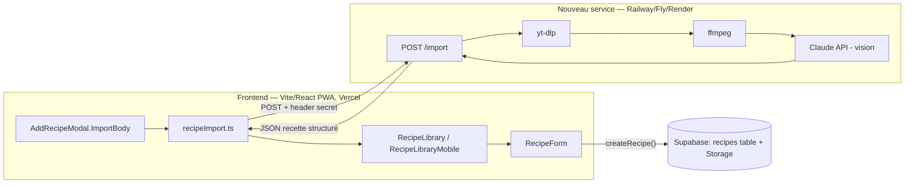

# PRD Technique — Import de recette depuis un lien Instagram

**Basé sur :** [doc/specs_insta.md](./specs_insta.md) (spec fonctionnelle)
**Stack :** React 18 + Vite + TypeScript (frontend), + un nouveau petit service Python (backend, à créer)
**Date :** 2026-07-15

---

## 1. Vue d'ensemble technique

Aujourd'hui, Cook Assistant est une PWA 100% client (Vite/React), sans aucun backend :
Supabase sert uniquement de base Postgres + Storage (policies anon ouvertes, pas d'auth),
et l'unique intégration IA existante (`src/lib/openai.ts`) appelle OpenAI **directement
depuis le navigateur** avec une clé exposée dans le bundle (`VITE_OPENAI_API_KEY`).

Cette feature ne peut pas suivre ce même pattern : le pipeline d'extraction a besoin de
`yt-dlp` et `ffmpeg` (téléchargement vidéo + extraction de frames), ce qui exige une
exécution serveur avec filesystem et subprocess — impossible en Edge Function (Deno,
pas de binaires) et fragile en serverless Vercel (packaging de binaires, limites de temps
d'exécution). On introduit donc **le premier vrai composant backend de l'app** : un petit
service HTTP dédié, appelé de façon synchrone par le frontend, qui garde la clé Anthropic
côté serveur et retourne un JSON recette structuré. Le frontend mappe ce JSON vers le
schéma `Recipe` existant et préremplit le formulaire de création déjà en place, en
réutilisant l'emplacement UI déjà prévu (mais désactivé) dans `AddRecipeModal.tsx`.

---

## 2. Architecture & composants



Le service backend est **stateless** : pas de DB, pas de queue, pas de fichiers persistés
au-delà de la durée d'une requête (répertoire temporaire nettoyé après chaque appel).

### Nouveaux composants à créer (frontend)

| Composant/fichier | Rôle | Props principales |
|---|---|---|
| `src/lib/recipeImport.ts` | Client HTTP vers le nouveau backend ; validation d'URL ; mapping JSON → `RecipeDraft` | `importFromUrl(url): Promise<RecipeImportResult>` |
| `src/types/recipeImport.ts` | Types partagés du contrat API (miroir TS du contrat backend) | — |

### Composants existants à modifier

| Composant | Modification |
|---|---|
| `src/components/AddRecipeModal.tsx` | `ImportBody` : remplacer le bloc désactivé "Coller un lien" par un vrai champ URL + bouton, états loading/erreur inline (§8). Ajouter un callback `onImported?: (draft: RecipeDraft) => void`. |
| `src/components/RecipeForm.tsx` | Le prop `recipe` accepte désormais `Partial<Recipe>` (pas besoin de `id`/`createdAt` pour le préremplissage — déjà le cas dans le code actuel, juste élargir le type). Nouveau prop optionnel `uncertainFields?: UncertainFields` pour signaler visuellement les champs incertains (bordure `border-ember`/icône ⚠, cf. §3). Nouveau champ caché/interne pour conserver `sourceUrl` jusqu'à la sauvegarde. |
| `src/pages/RecipeLibrary.tsx` | Nouveau state `importDraft: RecipeDraft | null`. Handler `handleImported(draft)` : ferme `AddRecipeModal`, ouvre `RecipeForm` en mode création avec `recipe={draft}` + `uncertainFields`. `handleSaveRecipe` doit transmettre `sourceUrl` à `createRecipe`. |
| `src/components/mobile/RecipeLibraryMobile.tsx` | Même câblage que ci-dessus côté mobile (`RecipeFormMobile` / `AddRecipeModal` y sont déjà utilisés). |
| `src/types/recipe.ts` | Ajout `sourceUrl?: string` sur `Recipe`. |
| `src/lib/recipes.ts` | `RecipeRow` : ajout `source_url: string | null`. `toRecipe`/`toRecipeRow` : mapping `sourceUrl` ↔ `source_url`. |

### Nouveaux hooks à créer

Aucun hook dédié nécessaire — l'état d'import (loading/erreur/résultat) reste local à
`AddRecipeModal.ImportBody` (un seul écran, pas de réutilisation ailleurs). Si un besoin de
réutilisation apparaît plus tard (ex. import depuis un autre point d'entrée), extraire
`useRecipeImport()`.

---

## 3. Data model

### Structures de données (frontend, TypeScript)

```ts
// src/types/recipeImport.ts

export type Confidence = 'high' | 'medium' | 'low';

/** Contrat retourné par le backend d'extraction (POST /import) */
export interface RecipeImportResponse {
  title: string;
  confidence: Confidence;
  servings: string | null;
  prep_time: string | null;
  cook_time: string | null;
  ingredients: { quantity: string | null; item: string }[];
  steps: string[];
  missing_info: string[];
  source_url: string;
  source_caption_used: boolean;
}

/** Champs du formulaire jugés incertains — piloté par missing_info, jamais persisté */
export interface UncertainFields {
  title?: boolean;
  servings?: boolean;
  cookingTime?: boolean;
  ingredients?: boolean[]; // index-aligné avec Recipe.ingredients
  steps?: boolean[];       // index-aligné avec Recipe.steps
}

/** Résultat exploitable côté UI après mapping */
export interface RecipeImportResult {
  draft: Partial<Recipe>; // title, ingredients, steps, cookingTime, servings, sourceUrl
  uncertainFields: UncertainFields;
  rawCaption?: string; // présent seulement sur fallback JSON invalide (§4.3)
}
```

### Mapping backend → `Recipe` existant

Le schéma `Recipe` (`src/types/recipe.ts`) reste inchangé dans sa forme, seul
`sourceUrl` est ajouté :

```ts
export interface Recipe {
  id: string;
  title: string;
  image?: string;
  ingredients: string[];   // ex. "400 g de pâtes" — inchangé
  steps: string[];
  cookingTime: number;     // minutes — inchangé
  servings: number;
  tags: string[];
  createdAt: string;
  sourceUrl?: string;      // NOUVEAU
}
```

Règles de mapping (`src/lib/recipeImport.ts`) :

- `ingredients[i]` : `formatIngredient({ quantity: quantity ?? '', name: item })` (réutilise
  `src/lib/ingredients.ts`, déjà utilisé par le formulaire) → produit une string
  `"400 g de pâtes"` cohérente avec le stockage `text[]` existant.
- `cookingTime` (number, minutes) : dérivé de `cook_time` (+ `prep_time` si présent) via un
  parseur best-effort (`parseDurationToMinutes(str): number | null` — nouvelle petite
  fonction dans `recipeImport.ts`). Si non parsable → valeur par défaut `30` (comportement
  actuel du formulaire) **et** champ marqué incertain.
- `servings` (number) : parse `servings` (ex. `"4 personnes"` → `4`). Non parsable → défaut
  `4`, marqué incertain.
- `confidence` et `missing_info` : **jamais persistés**. Utilisés uniquement pour construire
  `UncertainFields` côté client (ex. `confidence: "low"` → marque `title` incertain si
  `missing_info` contient une entrée mentionnant le titre ; sinon mapping heuristique par
  mot-clé sur `missing_info` — cf. tâche T4).
- `source_url` → `Recipe.sourceUrl`, persisté mais non mis en avant dans l'UI (cf. §8
  fonctionnel).
- `source_caption_used` : non utilisé par l'UI en v1 (info de debug/monitoring uniquement,
  peut être loggée côté backend).

### State management

Tout l'état d'import (URL saisie, loading, erreur, résultat) est **local** à
`AddRecipeModal.ImportBody` — pas de state global, pas de contexte. Le résultat mappé
(`RecipeImportResult`) remonte au parent (`RecipeLibrary`/`RecipeLibraryMobile`) via un seul
callback `onImported`, qui le pousse dans son state existant de gestion du formulaire
(`editingRecipe`-like), sans introduire de nouveau store.

### Migration Supabase (SQL)

```sql
alter table public.recipes
  add column source_url text;
```

Pas de changement de policy RLS nécessaire (les policies anon existantes couvrent déjà
toutes les colonnes via `select *` / `insert`/`update` sans liste de colonnes explicite).

---

## 4. API & intégrations

### 4.1 Contrat du nouveau backend

| Endpoint | Méthode | Input | Output | Notes |
|---|---|---|---|---|
| `/import` | POST | `{ "url": string }` + header `X-Import-Secret: <secret>` | `200`: `RecipeImportResponse` (§3) ; `4xx/5xx`: `{ "error": { "code": string, "message": string } }` | Synchrone, réponse attendue en ~5-15s, timeout serveur fixé à 45s (cf. 4.2) |
| `/health` | GET | — | `{ "status": "ok" }` | Pour monitoring/uptime check (§7 fonctionnel — taux d'échec) |

**Auth :** header `X-Import-Secret`, valeur statique partagée (env `IMPORT_SHARED_SECRET`
côté backend, `VITE_IMPORT_SHARED_SECRET` côté frontend). Requête sans le bon secret →
`401`. Ce secret est visible dans le bundle client comme `VITE_OPENAI_API_KEY` l'est déjà —
accepté au même niveau de risque pour un usage personnel (cf. §6, décision D3).

### 4.2 Codes d'erreur (mappés sur §8 de la spec fonctionnelle)

| `error.code` | HTTP | Cas | Comportement frontend |
|---|---|---|---|
| `invalid_url` | 422 | URL pas un lien Instagram valide | Normalement intercepté **avant** l'appel (validation regex côté client), ce code est un filet de sécurité côté serveur |
| `unauthorized` | 401 | Secret manquant/invalide | Erreur générique "Erreur de configuration" — ne devrait jamais arriver en usage normal (bug de config, pas un cas utilisateur) |
| `content_unavailable` | 404 | Post privé/inexistant | "Impossible d'accéder à ce contenu" + lien saisie manuelle |
| `download_failed` | 502 | `yt-dlp` échoue | Message générique d'échec + fallback saisie manuelle |
| `extraction_failed` | 502 | JSON LLM invalide après 1 retry backend | Fallback saisie manuelle, `rawCaption` (si dispo) précollé dans un champ libre |
| `timeout` | 504 | Pipeline > 45s | "Ça prend plus de temps que prévu" + option annuler (le frontend abandonne aussi côté client à 45s via `AbortController`, indépendamment de la réponse serveur) |
| `internal_error` | 500 | Erreur inattendue | Message générique + fallback saisie manuelle |

Le retry LLM (1 tentative en cas de JSON imparsable) est **interne au backend**, invisible
du frontend — le frontend ne voit qu'un succès ou `extraction_failed` final.

### 4.3 Pipeline backend (interne, non exposé en contrat)

1. Validation basique de l'URL (regex `instagram.com/(p|reel)/`)
2. `yt-dlp` : téléchargement vidéo + métadonnées (caption) dans un répertoire temporaire
   par requête (`tempfile.mkdtemp()`, nettoyé en `finally`)
3. `ffmpeg` : extraction de 3 frames équiréparties
4. Appel API Anthropic (Claude Haiku, vision + texte) avec les 3 frames + caption →
   JSON structuré (prompt hors périmètre technique, cf. spec fonctionnelle §11)
5. Validation du JSON retourné (schema check) ; si invalide → 1 retry de l'appel LLM ;
   si échec persistant → `extraction_failed` avec la caption brute dans la réponse d'erreur
   (`error.raw_caption`) pour permettre le fallback UI

---

## 5. Fichiers impactés

```
src/
├── types/
│   ├── recipe.ts                        ← modifier (ajout sourceUrl)
│   └── recipeImport.ts                  ← créer
├── lib/
│   ├── recipes.ts                       ← modifier (mapping source_url)
│   └── recipeImport.ts                  ← créer (client HTTP + mapping + validation URL)
├── components/
│   ├── AddRecipeModal.tsx               ← modifier (ImportBody fonctionnel)
│   └── RecipeForm.tsx                   ← modifier (prop uncertainFields, recipe: Partial<Recipe>)
├── components/mobile/
│   └── RecipeLibraryMobile.tsx          ← modifier (câblage import mobile)
└── pages/
    └── RecipeLibrary.tsx                ← modifier (state importDraft, handleImported)

supabase/
└── migrations/
    └── xxxx_add_source_url_to_recipes.sql   ← créer

import-service/                          ← NOUVEAU dossier (nouveau backend, repo séparé ou sous-dossier)
├── main.py                              ← FastAPI app, endpoint /import + /health
├── pipeline.py                          ← yt-dlp + ffmpeg + appel Claude
├── requirements.txt
├── Dockerfile
└── .env.example                         ← ANTHROPIC_API_KEY, IMPORT_SHARED_SECRET
```

**Décision à trancher (T0, cf. §6) :** `import-service/` vit-il dans ce même repo (monorepo,
non déployé par Vercel — juste un sous-dossier ignoré du build frontend) ou dans un repo
séparé ? Recommandation : sous-dossier de ce repo pour garder specs/code proches, déployé
indépendamment sur Railway/Fly via un Dockerfile dédié (Vercel ignore ce dossier, aucun
impact sur le build frontend existant).

---

## 6. Décisions techniques

| Question | Décision | Raison |
|---|---|---|
| Exécution sync vs async (job+polling) | **Synchrone** | Usage mono-utilisateur, pas de concurrence à gérer ; évite une table de jobs + endpoint de polling pour un gain marginal à cette échelle |
| Hébergement du pipeline | **Service dédié (Railway/Fly/Render), Python/FastAPI** | Seule option qui exécute proprement `yt-dlp`/`ffmpeg` (binaires + subprocess) sans les limites de temps/packaging de Vercel serverless ni l'absence de binaires sur Supabase Edge (Deno). **À confirmer par l'utilisateur avant implémentation (T0).** |
| Auth du endpoint | **Header secret partagé statique** | Cohérent avec le niveau de sécurité déjà accepté pour `VITE_APP_ACCESS_CODE`/`VITE_OPENAI_API_KEY` ; suffisant pour un usage perso, évite d'introduire un vrai système d'auth pour un seul utilisateur |
| Modèle IA | **Claude Haiku (vision + texte)**, clé côté serveur | Repris tel quel de la spec fonctionnelle §9 ; premier usage d'Anthropic dans l'app (jusqu'ici seul OpenAI est intégré, côté client) |
| Stockage `ingredients`/`steps` | **Strings formatées (`text[]`), pas d'objects structurés** | Suit la convention existante (`ingredients.ts`) pour rester compatible avec la liste de courses sans migration de schéma plus large |
| Confidence/missing_info | **Non persistés, dérivés en `UncertainFields` côté client uniquement** | Ce sont des signaux UX transitoires (écran de correction), pas des données de la recette finale — cohérent avec §7 de la spec fonctionnelle |

---

## 7. Tâches d'implémentation

Ordonnées par dépendance :

- [ ] **T0** — Confirmer l'hébergement du backend (Railway/Fly/Render) et créer le compte/projet (~1h) : décision bloquante pour T5-T7
- [ ] **T1** — Migration Supabase `source_url` + mise à jour `Recipe`/`RecipeRow`/mappers dans `src/lib/recipes.ts` (~1h)
- [ ] **T2** — `src/types/recipeImport.ts` : types du contrat API (~0.5h)
- [ ] **T3** — `src/lib/recipeImport.ts` : validation d'URL (regex Instagram), client HTTP (`fetch` + header secret + `AbortController` 45s), mapping `RecipeImportResponse → RecipeImportResult` (incluant `formatIngredient`, parsing durée/portions) (~3h)
- [ ] **T4** — Heuristique `missing_info → UncertainFields` (mapping mot-clé simple, ex. si une entrée de `missing_info` contient "portions"/"servings" → `uncertainFields.servings = true`) (~1.5h)
- [ ] **T5** — Backend : squelette FastAPI (`/health`, `/import` avec validation du header secret et de l'URL) (~2h)
- [ ] **T6** — Backend : pipeline `yt-dlp` → `ffmpeg` (3 frames) → appel Claude Haiku vision, avec retry JSON + gestion des codes d'erreur du §4.2 (~5h, dépend d'un prompt d'extraction à itérer)
- [ ] **T7** — Backend : Dockerfile (python + ffmpeg + yt-dlp), déploiement sur la plateforme choisie en T0, variables d'env (`ANTHROPIC_API_KEY`, `IMPORT_SHARED_SECRET`) (~2h)
- [ ] **T8** — `AddRecipeModal.ImportBody` : champ URL + validation inline + états loading/erreur, appel `importFromUrl`, callback `onImported` (~2.5h)
- [ ] **T9** — `RecipeForm` : élargir le type de `recipe` à `Partial<Recipe>`, ajouter prop `uncertainFields` + styles visuels (bordure/icône) sur les champs concernés (titre, portions, temps, lignes ingrédients/étapes) (~2.5h)
- [ ] **T10** — `RecipeLibrary.tsx` + `RecipeLibraryMobile.tsx` : state `importDraft`, `handleImported`, transmission de `sourceUrl` dans `handleSaveRecipe` → `createRecipe` (~2h)
- [ ] **T11** — Variables d'env frontend (`VITE_IMPORT_API_URL`, `VITE_IMPORT_SHARED_SECRET`) + `.env.example` (~0.5h)
- [ ] **Tests** — Tests unitaires `recipeImport.ts` (mapping, validation URL, heuristique uncertainFields) suivant le pattern existant (`recipeSearch.test.ts`, `chatSessionStorage.test.ts`) (~2h)
- [ ] **T12** — Test manuel end-to-end : lien réel Instagram → formulaire prérempli → sauvegarde → vérifier apparition identique dans planning/courses (~1h)

**Total estimé : ~27h** (hors itération sur le prompt d'extraction, dépendante de la qualité réelle des résultats — non estimable à l'avance).

---

## 8. Risques techniques

| Risque | Probabilité | Impact | Mitigation |
|---|---|---|---|
| `yt-dlp` cassé par un changement anti-scraping Instagram | Élevée (connu, cf. spec fonctionnelle §9) | Élevé (feature inutilisable) | `/health` + alerte simple sur taux d'échec (T7) ; pin de version + process de mise à jour documenté |
| Coût/latence du cold start sur hébergement à la demande (Railway/Fly en mode scale-to-zero) | Moyenne | Moyen (dépasse le budget UX 5-15s) | Préférer une instance always-on minimale vu le coût négligeable (spec fonctionnelle §9), ou accepter un premier appel plus lent |
| Secret partagé visible dans le bundle client | Élevée (certain) | Faible à cette échelle | Accepté explicitement (§6) ; même niveau de risque que `VITE_OPENAI_API_KEY` déjà en prod |
| Qualité d'extraction très variable selon la vidéo | Élevée (assumé dès la spec fonctionnelle, "pas d'objectif 100%") | Faible (écran de correction prévu) | Déjà mitigé par le design produit (`UncertainFields`, T4) |
| `RecipeForm` : élargir `recipe: Recipe → Partial<Recipe>` casse un usage existant en édition | Faible | Moyen (régression sur l'édition) | Type existant reste un sur-ensemble valide ; couvrir par un test manuel d'édition classique en T12 |

---

## 9. Définition of Done

- [ ] Tous les critères d'acceptance de la spec fonctionnelle (§10 de `specs_insta.md`) sont couverts
- [ ] Tests unitaires écrits et passants (`npm run test`)
- [ ] `npm run build` passe sans erreur TypeScript
- [ ] Pas de `console.log` dans le code final (hors `console.warn` déjà toléré dans `recipes.ts`)
- [ ] Code review effectuée
- [ ] `doc/ROADMAP.md` mis à jour (retirer l'item "Import de recettes depuis un lien" de "Plus tard")
- [ ] `doc/SUPABASE_INTEGRATION.md` mis à jour si la migration `source_url` change la table de référence documentée
